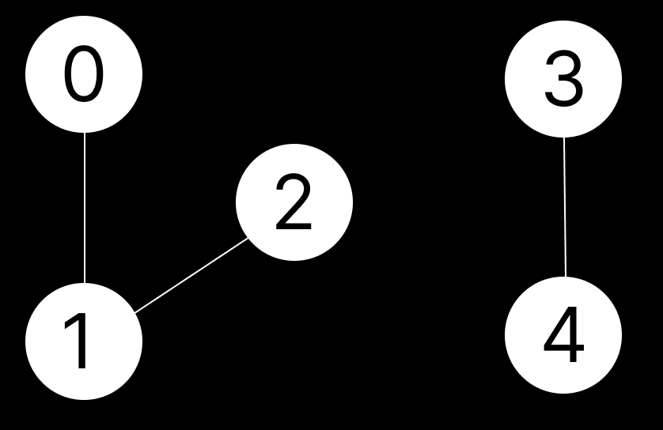
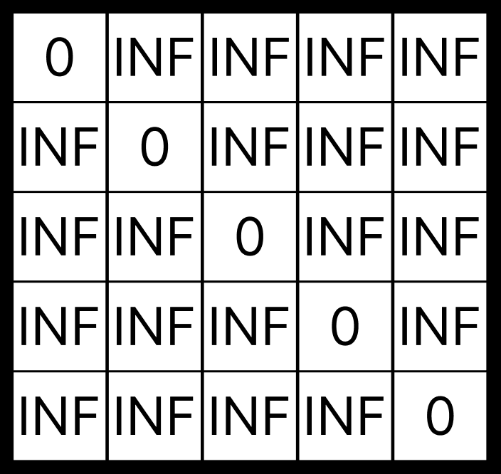
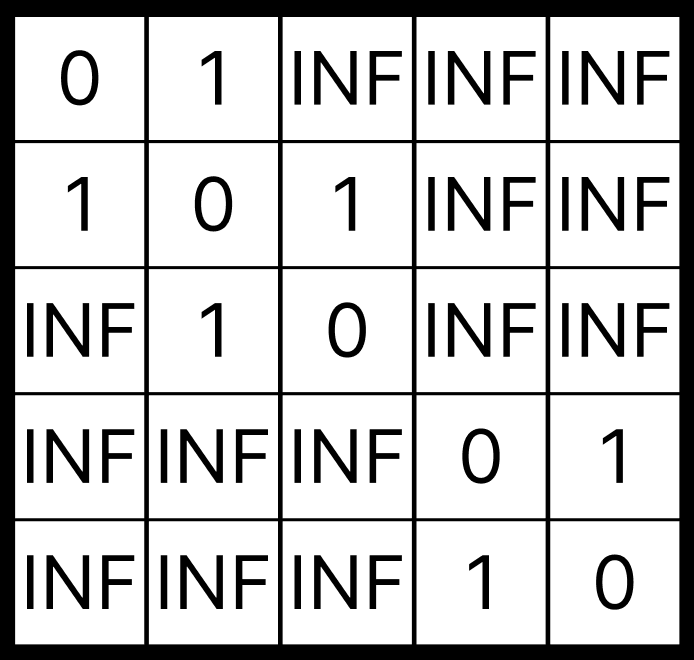
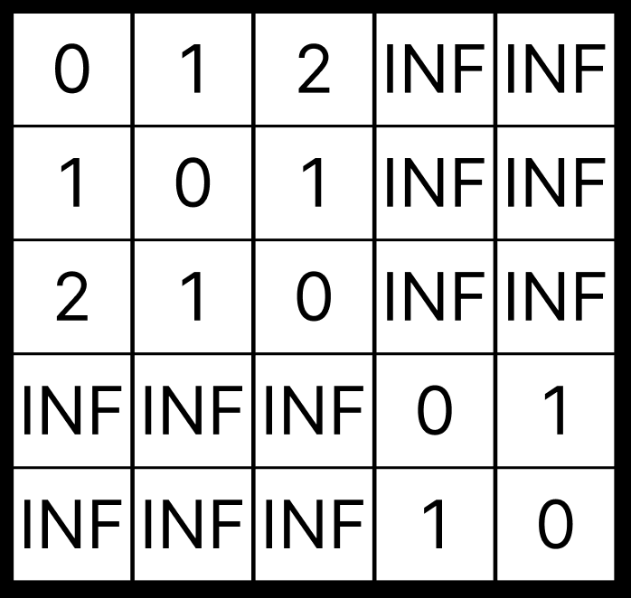
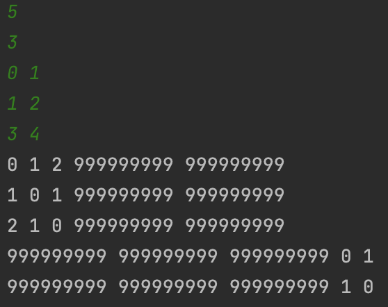

## 플로이드-워셜 알고리즘 (Floyd-Warshall)

플로이드-워셜 알고리즘이란 그래프의 각 모든 정점에서 각 모든 정점까지의 최단거리를 구하는 알고리즘이다.



다음과 같은 양방향 그래프가 있다고 하자. 편의상 모든 간선의 가중치는 1로 한다.

인접 행렬로 각 노드와 간선의 연결 상태를 나타낼 수 있다. 자기 자신으로 가는 경우는 0으로, 나머지는 구현에 영향을 주지 않는 매우 큰값 ( 여기서는 `INF = 999999999`) 으로 초기화 한다.



여기서 한개의 간선만을 거쳐서 가는 경우를 생각해보자. `0 <-> 1`, `1 <-> 2`, `3 <-> 4` 경우가 있다. 이 경우들에 대해서 인접행렬에 각각의 가중치를 저장한다.



다음으로 두개의 간선을 거쳐서 가는 경우를 생각해보자. 두개의 간선을 거쳐서 간다는 소리는 a 노드에서 b 노드로 갈 때 반드시 임의의 k 노드를 하나만 방문한다는 말과 같다. 

예시로 든 그림은 그래프 형태가 매우 단순하므로 1번 노드를 거쳐가는 방법밖에 없지만, 매우 복잡한 그래프가 주어진다면 눈으로만 계산하기 힘들 것이다.

따라서 **'a 노드에서 b 노드로 갈건데, (모든 노드에 대해 반복문을 돌며) i 번째 노드를 거쳐 갈 것이다.'** 라는 개념을 도입할 수 있다. 그렇게 경로의 가중치를 합해 인접행렬의 값과 비교해 더 작은 값을 선택하는 것이다.

예시로 주어진 그래프에 적용해보자.

- 0번 노드에서 2번 노드로 갈건데, 1번 노드를 거쳐 갈 것이다. 라고 예를 든다면 소모되는 총 가중치는 2일 것이고, 인접행렬의 값인 `INF` 와 비교해서 더 작은 값인 2로 갱신되는 것이다.
- 만약 0번과 2번 노드 사이에도 간선이 존재한다고 가정한다면, 저장되어있던 인접행렬의 값은 1이었을 것이고 1번 노드를 거쳐간 경우의 가중치인 2와 비교했을 때 1이 더 작으므로 갱신되지 않고 1이 그대로 남아있을 것이다.



최종적으로 인접행렬은 이렇게 만들어 질 것이다. 

이때 `arr[i][j]`가 의미하는 바는

- `i`번 노드에서 `j`번 노드로 가는 비용
- `INF` 라면, `i`  번 노드에서 `j`번 노드로 가는 방법이 없음

<br>

---

코드를 통해 살펴보자.

````java
import java.io.BufferedReader;
import java.io.IOException;
import java.io.InputStreamReader;

public class Playground {
        static int node, edge;
        static int[][] arr;
        static final int INF = 999999999;

    public static void main(String[] args) throws IOException {
        BufferedReader br = new BufferedReader(new InputStreamReader(System.in));
				
      	/*
      		첫번째 줄에 노드의 개수 node
      		두번째 줄에 간선의 개수 edge
      		다음 edge개의 줄에는 연결된 노드가 공백을 사이에 두고 주어짐
      	*/
        node = Integer.parseInt(br.readLine());
        edge = Integer.parseInt(br.readLine());
        arr = new int[node][node];

        // arr 배열 초기화
        for (int i = 0; i < node; i++) {
            for (int j = 0; j < node; j++) {
                if(i == j){
                    arr[i][j] = 0;
                    continue;
                }
                arr[i][j] = INF;
            }
        }

      	// 간선이 존재하면 가중치인 1로 바꿈
        for (int i = 0; i < edge; i++) {
            String[] tmp = br.readLine().split(" ");
            int a = Integer.parseInt(tmp[0]);
            int b = Integer.parseInt(tmp[1]);

            arr[a][b] = arr[b][a] = 1;
        }

      	// 플로이드-워셜 알고리즘
        for (int k = 0; k < node; k++) {
            for (int i = 0; i < node; i++) {
                for (int j = 0; j < node; j++) {
                    arr[i][j] = Math.min(arr[i][j], arr[i][k] + arr[k][j]);
                }
            }
        }

      	// 출력
        for (int i = 0; i < node; i++) {
            for (int j = 0; j < node; j++) {
                System.out.print(arr[i][j] + " ");
            }
            System.out.println();
        }
    }
}
````

플로이드-워셜 알고리즘을 코드로 보면 삼중 반복문의 매우 단순한 형태이다.

이 반복문에서의 핵심은 `i` 번 노드에서 `j` 번 노드로 가는데 `k` 번 노드를 거쳐서 가는 경우를 보는 것이다. 그리고 원래의 값과 비교해 더 작은 쪽을 선택하는 것이다.



예시로 주어진 그래프를 입력해보면 결과가 잘 출력되는것을 확인할 수 있다.

<br>

플로이드-워셜 알고리즘은 삼중 반복문을 이용하므로 주어진 노드의 개수가 N개일 때, `O(N^3)` 의 시간복잡도를 가진다. 따라서 알고리즘 문제를 풀 때는 입력 개수를 잘 보고 사용 여부를 판단하자.