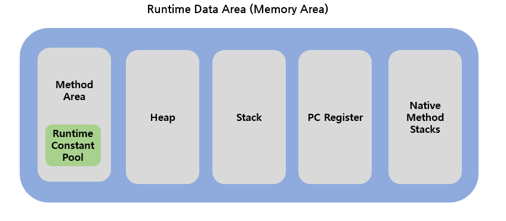

## JVM과 메모리 구조

---

자바 프로그램은 다른 프로그램과 달리 JVM에 의해 실행되므로 어떤 운영체제에서도 동일한 결과를 갖는다.

따라서 JVM의 구조 및 메모리 구조를 잘 이해하고 있다면 보다 안정적인 프로그램을 개발하는데 도움이 될 것이다.

### JVM 구조

- Java Compiler : `.java`로 작성된 소스코드를 `.Class` 파일로 변환한다.
- Class Loader : 변환된 `.Class` 파일을 메모리에 저장한다. 런타임 시에 동적으로 클래스를 로드한다.
- Execution Engine : Class Loader에 저장된 파일을 명령어 단위로 하나씩 실행하게 한다.
  - 최초 JVM이 나왔을 당시에는 인터프리터 방식으로 속도면에서 단점이 있었지만, JIT 컴파일러 방식을 통해 이 점을 보완했다. JIT는 바이트 코드를 어셈블러 같은 네이티브 코드로 바꿈으로써 실행이 빠르다. 하지만 변환에 비용이 발생하기 때문에 JVM은 인터프리터 방식을 사용하다가 일정한 기준이 넘어가면 JIT 컴파일러 방식으로 실행하게 된다.
- Garbage Collector : 사용하지 않는 객체를 메모리에서 제거한다.
- Runtime Data Area : JVM이 프로그램을 수행하기 위해 운영체제로부터 할당받은 메모리 공간이다.

### Memory Area(Runtime Data Area)의 구조

JVM의 구조 중 메모리영역의 구조에 대해 알아보자.

- Method Area
  - JVM이 실행되면서 생기는 공간이다.
  - Class, 전역변수, Static 변수 정보가 저장된다.
  - Runtime Constant Pool에는 상수가 저장된다.
  - 모든 스레드에서 정보가 공유된다.
- Heap
  - `new` 연산자로 생성된 객체, `Array`와 같은 동적으로 생성된 데이터가 저장되는 공간이다.
  - GC가 처리하지 않는 이상 소멸되지 않는다.
  - 참조형 타입의 데이터가 저장되는 공간이다.
  - 모든 스레드에서 정보가 공유된다.
- Stack
  - 지역변수, 메서드의 매개변수같이 일시적으로 사용되는 데이터가 저장되는 공간이다.
  - Stack이라는 말 그대로 LIFO 방식이다.
  - 지역변수지만 참조형인 데이터는 Heap에 저장된 데이터의 주소값을 스택에 저장한다.
  - 스레드마다 하나씩 존재한다.
- PC Register
  - 스레드가 생성되면서 생기는 공간이다.
  - 스레드가 어느 명령어를 처리하고 있는지 주소를 등록한다.
  - JVM이 실행하고 있는 현재 위치를 저장하는 역할이다.
- Native Method Stack
  - Java가 아닌 다른 언어로 구성된 메서드의 실행이 필요할 때 사용하는 공간이다.

> ### 참조
>
> - [shin_stealer.log - 자바의 메모리 구조](https://velog.io/@shin_stealer/%EC%9E%90%EB%B0%94%EC%9D%98-%EB%A9%94%EB%AA%A8%EB%A6%AC-%EA%B5%AC%EC%A1%B0)
> - [느리더라도 꾸준하게 - JVM 메모리 구조란? (Java)](https://steady-coding.tistory.com/305)
