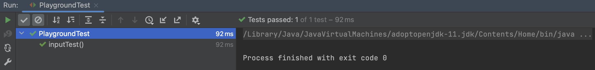

## JUnit에서 콘솔창 입출력 테스트하는 방법

사용자 입력이 아닌 콘솔창에서 입력되는 입력값 혹은 콘솔창으로 출력되는 결과로 테스트를 하기 위해서는 어떻게 해야 할까?

### 입력

- `InputStream in = new ByteArrayInputStream(input.getBytes());`
- `System.setIn(in);`

위의 둘을 이용해 `input` 문자열을 입력시킬 수 있다.

### 출력

- `OutputStream out = new ByteArrayOutputStream();`
- `System.setOut(new PrintStream(out));`

위의 둘을 이용해 콘솔에 출력되는 문자열을 `OutputStream` 타입으로 받아올 수 있다.

<br>

### 예제

간단히 `3 + 7` 덧셈의 결과를 입력받는 메서드를 만들어보자.

#### 메인 메서드와 `getResult()` 메서드

````java
public class Playground {
    public static void main(String[] args) throws IOException {
        System.out.print("3 + 7 = ");
        getResult();
    }

    public static void getResult() throws IOException {
        BufferedReader br = new BufferedReader(new InputStreamReader(System.in));
        int inputNum = Integer.parseInt(br.readLine());

        if(inputNum == 10) {
            System.out.print("정답입니다.");
        }else{
            System.out.print("틀렸습니다.");
        }
    }
}
````

> `System.out.print(3 + 7 = )` 부분까지 `getResult()` 메서드에 같이 있으면, `getResult()` 메서드를 테스트 하는 과정에서 `out`에 같이 저장되버리기 때문에 메인 메서드로 따로 분리해준다.

#### 테스트코드

````java
class PlaygroundTest {

    @Test
    void inputTest() throws IOException {
        String input = "10";
        InputStream in = new ByteArrayInputStream(input.getBytes());
        System.setIn(in);
        OutputStream out = new ByteArrayOutputStream();
        System.setOut(new PrintStream(out));

        Playground.getResult();

        Assertions.assertThat(out.toString()).isEqualTo("정답입니다.");
    }
}
````

> `getResult()` 메서드의 출력 부분을 보면 `println()`이 아닌 `print()`를 사용하는 것을 볼 수 있는데, 이는 테스트코드에서 문자열 `"정답입니다."`와 비교하기 때문이다.
>
> `println()`에는 줄바꿈 문자열이 포함되어 있으므로 `println()`을 사용했으면 비교할 문자열 역시 `"정답입니다\n"`과 비교해야 한다.

### 테스트 결과



