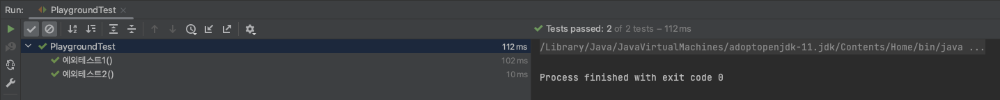

## JUnit에서 예외 테스트하는 방법

JUnit에서 예외와 예외 메시지를 테스트하려면 어떻게 해야 할까?

<br>

### 예제

#### 메인 메서드와 숫자를 입력받아 검증하는 `getResult()` 메서드

````java
public class Playground {
    public static void main(String[] args) throws IOException {
        System.out.print("숫자를 입력해주세요 : ");
        int inputNum = getResult();

        System.out.println("입력하신 숫자는 " + inputNum + " 입니다.");
    }

    public static int getResult() throws IOException {
        BufferedReader br = new BufferedReader(new InputStreamReader(System.in));
        String inputNum = br.readLine();
        int num;

        try {
            num = Integer.parseInt(inputNum);
        } catch (Exception e){
            throw new IllegalArgumentException("숫자만 입력해주세요.");
        }

        return num;
    }
}
````

사용자가 입력한 값을 `int` 타입으로 변환해보고, 숫자가 아니어서 변환이 불가능할 시에 `IllegallArgumentException`을 던진다.

#### 테스트코드

````java
class PlaygroundTest {
    @BeforeAll
    static void init(){
        String input = "abc";
        InputStream in = new ByteArrayInputStream(input.getBytes());
        System.setIn(in);
    }

    @Test
    void 예외테스트1(){
        Assertions.assertThatThrownBy(() -> Playground.getResult())
                .isInstanceOf(IllegalArgumentException.class);
    }

    @Test
    void 예외테스트2(){
        Throwable exception = assertThrows(IllegalArgumentException.class, () -> {
            Playground.getResult();
        });
        assertEquals("숫자만 입력해주세요.", exception.getMessage());
    }
}
````

`예외테스트1`에서는 발생된 예외가 `IllegalArgumentException`이 맞는지 검증해주는 테스트코드이다.

`예외테스트2`에서는 발생된 예외의 예외 메시지까지 검증할 수 있다.

> 2에서의 `Assertions`는 `assertj`의 `assertThatThrownBy()`임을 주의하자.

#### 테스트결과



